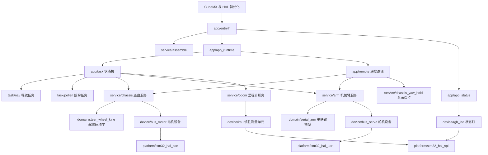
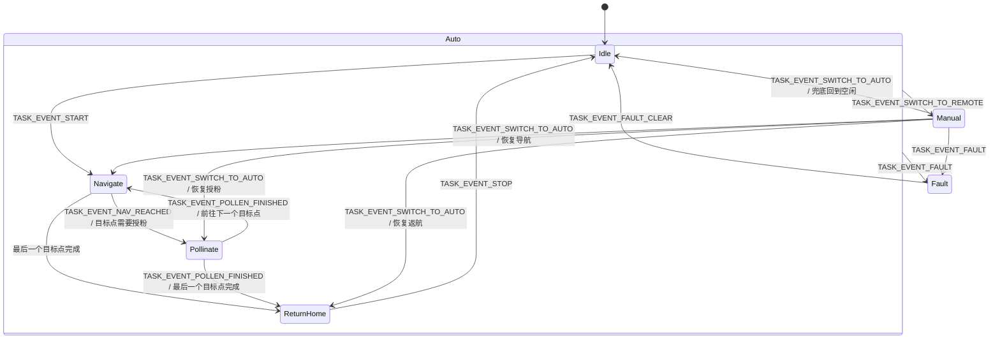

<div align="center">

# Steering-Wheel-Chassis

[](#)
[](#)
[](#license)

</div>

> 基于 STM32H7 的四舵轮底盘控制工程，包含舵轮运动学、底盘电机控制、IMU/里程计融合、遥控接管、五轴串联机械臂、导航点任务状态机与授粉动作流程

本项目主要面向比赛/实验平台中的农业舵轮底盘机器人；代码采用分层架构组织，将 `app` 业务流程、`service` 服务封装、`device` 设备驱动、`domain` 纯算法、`infra` 基础设施和 `platform` 平台适配尽量解耦，方便后续迁移到不同硬件平台或替换局部模块

---

## 目录

- [项目特点](#项目特点)
- [系统架构](#系统架构)
- [硬件配置](#硬件配置)
- [软件环境](#软件环境)
- [工程目录](#工程目录)
- [快速开始](#快速开始)
- [运行调度](#运行调度)
- [控制模式](#控制模式)
- [自主任务流程](#自主任务流程)
- [核心模块说明](#核心模块说明)
- [移植检查清单](#移植检查清单)
- [调试说明](#调试说明)
- [参与贡献](#参与贡献)
- [开源协议](#开源协议)

---

## 项目特点

### 四舵轮底盘控制

- 支持四个独立舵轮模块，当前模块顺序为 `FL`、`FR`、`RR`、`RL`
- 支持逆运动学计算，将底盘速度 `vx`、`vy`、`wz` 转换为各轮目标轮速与目标转角
- 支持正运动学计算，将各轮反馈轮速与反馈转角估计为底盘速度
- 支持舵向等效角选择，通过轮速反向减少舵轮转向行程
- 支持等效角滞回处理，减少目标角在临界位置反复跳变
- 支持先转向后驱动模式，舵轮角度接近目标后再输出驱动轮速度
- 支持刹车姿态控制，可先将舵轮转到刹车角度，再执行电机刹车或停止

### 电机抽象与驱动封装

- 转向电机使用达妙电机实例，当前按位置速度模式组织
- 驱动电机使用大疆 `M2006/C610` 类速度控制接口
- 上层通过 `BusMotorInterface` 访问电机，降低业务层对具体协议的依赖
- 转向电机与驱动电机分离到不同 `CAN` 总线，便于调试与扩展

### 惯性测量单元与里程计

- 支持 `BMI088` 驱动
- 包含阻塞式实例与面向 `SPI DMA` 的实例结构
- `imu_attitude` 模块负责姿态估计相关算法
- `service/odom.*` 提供底盘与惯性测量单元融合入口

### 遥控接管与安全回退

- 支持 `FlySky FS-iA10B i.BUS` 接收机解析
- 支持通过拨杆进入遥控接管模式
- 支持底盘手动控制与机械臂手动控制
- 支持底盘航向保持控制
- 支持故障取消、刹车回退、任务暂停等上层安全钩子

### 应用任务状态机

- 使用 `infra/hfsm` 实现分层有限状态机
- 支持自主任务启动、导航点切换、授粉动作、返航、故障处理、遥控接管后恢复
- 导航点表与机械臂动作表集中放置，便于按比赛任务或实验场景修改
- 故障状态中保留来源、等级、代码、取消掩码等信息，便于后续扩展诊断逻辑

### 可复用基础设施

- 轻量日志模块
- 延时与时间辅助模块
- 比例积分微分控制器
- 矩阵辅助工具
- 协议解析工具
- 分层有限状态机库
- `STM32 HAL` 平台适配层

---

## 系统架构



核心分层思路如下

```text
app      : 应用流程、任务状态机、遥控模式、安全策略
service  : 面向业务的稳定服务接口，例如 chassis、arm、odom
device   : 设备抽象与具体驱动，例如 motor、servo、imu、rgb_led
domain   : 不依赖真实硬件的运动学、姿态、滤波和数学模型
infra    : 日志、控制器、矩阵、协议解析、状态机、延时等基础设施
platform : STM32 HAL 适配层，集中处理 CAN、UART、SPI、TIM、EXTI、DWT 等平台细节
```

这种结构的目的不是追求目录复杂，而是让每一层承担清晰职责

- `app` 负责做什么任务
- `service` 负责给任务提供稳定能力
- `device` 负责把设备能力抽象出来
- `domain` 负责可脱离硬件测试的算法
- `infra` 负责可复用的小型基础库
- `platform` 负责隔离 `STM32 HAL` 句柄、回调和外设细节

---

## 硬件配置

当前代码默认使用 `STM32 HAL` 与 `CubeMX` 生成的初始化句柄，主要硬件配置如下

| 类别 | 当前配置 |
|---|---|
| 主控芯片 | `STM32H723VGT6` |
| 主循环定时器 | `TIM6` 触发 `500 Hz` 调度标志 |
| 转向电机 | 达妙电机，`FDCAN1`，位置速度模式 |
| 驱动电机 | 大疆 `M2006/C610` 类电机，`FDCAN2`，速度模式 |
| 惯性测量单元 | `BMI088`，`SPI2`，加速度计与陀螺仪数据就绪中断 |
| 遥控接收机 | `FlySky FS-iA10B i.BUS`，`UART5` 单字节中断接收 |
| 机械臂舵机 | 飞特 `SCS/STS` 类总线舵机，`UART7` 阻塞读写 |
| 语音模块 | `ASRPRO` 类语音模块，`UART10` 阻塞写入 |
| 状态灯 | `WS2812 RGB` 灯，`SPI6 DMA` 发送 |
| 调试日志 | `UART1` 阻塞日志输出，并带简单命令输入 |

当前舵轮模块映射如下

| 模块 | 含义 | 转向电机编号 | 驱动电机编号 | 驱动方向 |
|---|---|---:|---:|---:|
| `FL` | 左前 | 1 | 1 | +1 |
| `FR` | 右前 | 2 | 2 | -1 |
| `RR` | 右后 | 3 | 3 | -1 |
| `RL` | 左后 | 4 | 4 | +1 |

底盘模型参数在 `src/service/assemble/assemble_chassis.c` 中配置

```c
.model = {
    .length = 0.26572986916f,
    .width = 0.26572986916f,
    .wheel_radius = 0.035276f,
    .max_wheel_linear_speed = 2.0f,
},
```

这些参数与当前实物底盘有关，换底盘后必须重新测量并修改

---

## 软件环境

推荐环境如下

| 工具 | 用途 |
|---|---|
| `STM32CubeMX` 或 `STM32CubeIDE` | 生成与维护 `HAL` 初始化代码 |
| `VS Code` 与 `EIDE` | 打开已有工程配置并编译下载 |
| `ARM GCC` 或 `arm-none-eabi-gcc` | 嵌入式交叉编译工具链 |
| `C` 语言 | 主要代码语言 |
| `STM32 HAL` | 平台层依赖的外设访问接口 |

本仓库是一个嵌入式 `STM32` 工程，`src/` 目录主要放应用代码、算法代码、驱动封装和基础库，`CubeMX` 生成代码与工程配置则保留在仓库其他目录中

---

## 工程目录

```text
Steering-Wheel-Chassis/
├── Core/                         # CubeMX 或 HAL 生成代码
├── arm_description/              # 机械臂模型或工具链描述文件
├── src/                          # 主要源码
│   ├── app/                      # 应用入口、运行时、状态灯、遥控、任务流程
│   │   ├── entry.h               # CubeMX main.c 的应用接入层
│   │   ├── app_runtime.*         # 自动模式、遥控接管、安全钩子
│   │   ├── app_status.*          # 状态灯与心跳日志
│   │   ├── remote.*              # 遥控业务逻辑
│   │   └── task/                 # 基于 HFSM 的自主任务系统
│   ├── service/                  # 面向业务的服务层
│   │   ├── assemble/             # 硬件与服务装配，依赖注入集中处
│   │   ├── chassis.*             # 四舵轮底盘服务
│   │   ├── chassis_yaw_hold.*    # 航向保持控制器
│   │   ├── odom.*                # 惯性测量单元与底盘里程计服务
│   │   ├── arm.*                 # 五自由度机械臂服务
│   │   └── asrpro.*              # 语音播报命令封装
│   ├── device/                   # 设备驱动与统一设备接口
│   │   ├── bus_motor/            # 总线电机抽象、达妙电机、大疆电机实例
│   │   ├── bus_servo/            # 总线舵机抽象、飞特舵机实例
│   │   ├── imu/                  # 惯性测量单元门面、BMI088 驱动、姿态算法
│   │   ├── rgb_led/              # 状态灯门面、WS2812 实例
│   │   └── fs_ia10b.*            # FS-iA10B i.BUS 接收机解析
│   ├── domain/                   # 纯算法与机构模型
│   │   ├── steer_wheel_kine.*    # 四舵轮底盘运动学
│   │   ├── serial_arm/           # 串联机械臂正逆运动学模型
│   │   └── kalman/               # 基于卡尔曼的底盘与惯性测量单元融合
│   ├── infra/                    # 可复用基础设施
│   │   ├── hfsm/                 # 分层有限状态机库
│   │   ├── delay.*               # 时间与延时辅助
│   │   ├── log.*                 # 轻量日志模块
│   │   ├── matrix.*              # 矩阵工具
│   │   ├── pid.*                 # 比例积分微分控制器
│   │   └── protocol_parser.*     # 环形缓冲区与协议解析辅助
│   └── platform/                 # STM32 HAL 适配层
│       ├── stm32_hal_can.*
│       ├── stm32_hal_uart.*
│       ├── stm32_hal_spi.*
│       ├── stm32_hal_tim.*
│       ├── stm32_hal_exti.*
│       ├── stm32_hal_dwt.*
│       └── stm32_hal_bmi088.*
├── robot.ioc                     # CubeMX 工程文件
├── robot.code-workspace          # VS Code 工作区文件
├── STM32H723VGTX_FLASH_USER.ld   # 链接脚本
└── README.md
```

---

## 快速开始

### 获取仓库

```bash
git clone https://github.com/Kaede-Rei/Steering-Wheel-Chassis.git
cd Steering-Wheel-Chassis
```

### 打开工程

推荐方式

1. 使用 `STM32CubeMX` 或 `STM32CubeIDE` 打开 `robot.ioc` 生成初始化代码
2. 使用 `VS Code EIDE` 打开 `robot.code-workspace`
3. 检查目标芯片、链接脚本、外设配置是否与自己的控制板一致
4. 按 `EIDE` 工作流编译、下载、调试

备用方式

1. 使用 `STM32CubeMX` 或 `STM32CubeIDE` 打开 `robot.ioc` 生成初始化代码
2. 将 `src/` 加入工程源码树
3. 添加必要的头文件搜索路径
4. 在 `HAL` 与 `CubeMX` 初始化完成后调用 `entry_init()`
5. 在主循环中持续调用 `entry_loop()`
6. 检查目标芯片、链接脚本、外设配置是否与自己的控制板一致
7. 按自己的 `STM32` 工程工作流编译、下载、调试

### 头文件路径

至少需要按构建系统新增以下头文件路径

```text
src/app
src/service
src/device
src/domain
src/infra
src/platform
```

### 主函数接入方式

在 `CubeMX` 生成的 `main.c` 中，应用层建议通过 `entry.h` 接入

```c
#include "entry.h"

int main(void)
{
    HAL_Init();
    SystemClock_Config();

    MX_GPIO_Init();
    MX_DMA_Init();
    MX_FDCAN1_Init();
    MX_FDCAN2_Init();
    MX_SPI2_Init();
    MX_SPI6_Init();
    MX_TIM6_Init();
    MX_USART1_UART_Init();
    MX_UART5_Init();
    MX_UART7_Init();
    MX_UART10_Init();

    entry_init();

    while (1) {
        entry_loop();
    }
}
```

其中 `MX_*_Init()` 的具体列表需要以自己的 `CubeMX` 配置为准

---

## 运行调度

`entry_loop()` 使用 `TIM6` 产生的 `500 Hz` 标志作为主快速循环

| 频率 | 函数 | 职责 |
|---:|---|---|
| `500 Hz` | `chassis.process()` | 底盘电机反馈、运动学计算、指令输出 |
| `500 Hz` | `app_runtime_process()` | 模式切换、启动条件、安全钩子、任务状态机 |
| `250 Hz` | `odom.process()` | 惯性测量单元与底盘里程计更新 |
| `100 Hz` | `remote_process()` | `i.BUS` 保活与遥控输出 |
| `50 Hz` | `arm.refresh_current_state()` | 机械臂舵机反馈刷新与稳定性日志 |
| 后台循环 | `app_status_process()` | 状态灯与心跳日志 |

`entry_init()` 中的启动顺序如下

```text
assemble_delay
-> assemble_log
-> assemble_rgb
-> assemble_imu
-> assemble_odom
-> assemble_chassis
-> assemble_arm
-> assemble_remote
-> remote_init
-> app_runtime_init
-> app_status_init
-> assemble_tim6_500hz
```

这样的顺序保证日志、时间、状态灯、传感器、底盘、机械臂、遥控、任务运行时依次就绪

---

## 控制模式

### 自动模式与遥控接管

`app_runtime` 使用 `FS-iA10B` 通道判断机器人处于自动模式还是遥控接管模式

| 通道 | 当前代码中的含义 |
|---|---|
| `SWD` | 自动模式与遥控接管切换，低位进入遥控接管，高位允许自动启动 |
| `VRA` 与 `VRB` | 自动启动确认，二者都需要达到设定高阈值 |
| `SWA` | 遥控接管期间用于机械臂力矩释放逻辑与遥控子模式选择 |

自主任务启动条件如下

```text
遥控器在线
并且 SWD 处于高位
并且 VRA 大于等于启动阈值
并且 VRB 大于等于启动阈值
```

### 底盘手动控制

遥控接管生效，并且 `SWA` 选择底盘控制时，通道含义如下

| 输入 | 行为 |
|---|---|
| 右摇杆纵向 | 控制 `vx` |
| 右摇杆横向 | 控制 `vy` |
| 左摇杆横向 | 控制 `wz` |
| `SWB` | 速度档位，低速、中速、高速 |
| `SWC` 低位 | 关闭先转向后驱动 |
| `SWC` 中位 | 开启先转向后驱动 |
| `SWC` 高位 | 刹车 |
| `VRA` 低位 | 刹车 |
| `VRB` 高位 | 阻止底盘运动 |

### 机械臂手动控制

遥控接管生效，并且 `SWA` 选择机械臂控制时，通道含义如下

| 输入 | 行为 |
|---|---|
| `SWB` | 机械臂速度档位 |
| `SWC` 高位 | 机械臂移动到配置的舵机零位 |
| `SWC` 低位 | 腕部或末端关节模式，右摇杆控制俯仰与偏航关节 |
| `SWC` 中位 | 工作空间模式，左摇杆控制底座偏航，右摇杆控制伸展距离与高度 |
| `VRB` 高位 | 阻止机械臂运动 |

---

## 自主任务流程

自主任务主状态机位于 `src/app/task/task.c`，底层使用 `infra/hfsm`



当前路线表如下

| 路线 | 文件 | 数量 | 说明 |
|---|---|---:|---|
| 主导航路线 | `src/app/task/nav/navigation_route.c` | 21 个点 | 包含 `START_END`、`PASS_BY`、`AREA_A`、`AREA_B`、`AREA_C` |
| 返航路线 | `src/app/task/nav/navigation_route.c` | 2 个点 | 最后一个目标点完成后使用 |
| 授粉动作路线 | `src/app/task/pollen/pollen_route.c` | 每组最多 6 步 | 使用五自由度关节数组描述动作 |

当前自主行为仍是表驱动任务流程，不是基于视觉感知或实时建图的完整导航栈，换场地、换车体、换比赛规则时，需要重新配置航点表与机械臂动作表

---

## 核心模块说明

### `service/chassis`

`service/chassis.*` 是面向业务层的底盘接口，隐藏电机协议细节，对上层暴露高层控制能力

```c
chassis.init(&config);
chassis.set_velocity(vx, vy, wz);
chassis.set_steer_then_drive_enabled(true);
chassis.process();
chassis.stop();
chassis.brake();
```

关键内部行为如下

- 调用 `steer_wheel_ik()` 计算目标轮速与目标舵角
- 在输出控制前读取转向电机与驱动电机反馈
- 对舵轮目标角做等效角优化
- 在必要时通过驱动轮反向减少转向行程
- 对转向过程做速度规划，降低舵向突变
- 在多处上层安全路径中使用 `brake()` 作为默认回退动作

### `domain/steer_wheel_kine`

这是纯运动学模块，不依赖 `HAL`、`CAN`、`UART` 或真实电机

- 输入为底盘速度 `vx`、`vy`、`wz`
- 输出为四个舵轮模块的目标轮速与目标舵角
- 反馈为四个舵轮模块的实测轮速与实测舵角
- 输出里程计速度 `cur_vx`、`cur_vy`、`cur_wz`

单位约定如下

| 物理量 | 单位 |
|---|---|
| 距离 | 米 |
| 角度 | 弧度 |
| 线速度 | 米每秒 |
| 角速度 | 弧度每秒 |

### `device/bus_motor`

电机抽象层由以下部分组成

- `bus_motor.*`，通用电机接口与状态码
- `agv_motor.*`，面向底盘角色的转向电机与驱动电机绑定
- `dm_motor.*`，达妙电机协议实例
- `dji_motor.*`，大疆 `M3508/C620` 类速度控制实例

上层代码应优先依赖 `BusMotorInterface`，避免直接依赖某一个具体电机协议

### `device/imu`

惯性测量单元模块包含以下部分

- `imu.*`，通用惯性测量单元门面
- `bmi088.*`，`BMI088` 驱动
- `imu_attitude.*`，姿态融合相关纯算法

当前装配路径中主要使用 `bmi088_blocking_instance`，如果切换到完整 `DMA` 与中断异步方式，需要重新检查 `SPI DMA` 回调与数据就绪中断接线

### `infra/hfsm`

`infra/hfsm` 是可复用的分层有限状态机库，当前被 `app/task` 用来组织自主任务

典型使用方式如下

```c
hfsm.init(&task->fsm, &task->ctx);

s_auto = hfsm.add_state(&task->fsm, "Auto");
s_idle = hfsm.add_substate(&task->fsm, s_auto, "Idle");

hfsm.set_handle(s_idle, idle_handle);
hfsm.set_entry(s_idle, idle_entry);
hfsm.set_initial(&task->fsm, s_idle);
hfsm.start(&task->fsm);

hfsm.post(&task->fsm, TASK_EVENT_START, NULL);
hfsm.process(&task->fsm);
```

推荐用法如下

- 父状态处理公共事件，例如遥控接管、故障、停止
- 子状态处理局部事件，例如导航完成、授粉完成、返航完成
- `entry` 负责进入状态时的一次性准备
- `action` 负责周期性推进子流程
- `handle` 负责处理事件并决定是否迁移状态
- 事件数据通过指针传入，生命周期需要由上层保证

---

## 移植检查清单

### 检查 `CubeMX` 与 `HAL` 命名

平台层直接引用了一些 `CubeMX` 符号，若自己的工程命名不同，需要修改 `src/platform/*` 或重新做适配

```text
hfdcan1, hfdcan2
hspi2, hspi6
htim6
huart1, huart5, huart7, huart10
ACC_INT_Pin, GYRO_INT_Pin
ACC_CS_GPIO_Port, ACC_CS_Pin
GYRO_CS_GPIO_Port, GYRO_CS_Pin
CAN1_EN_GPIO_Port, CAN1_EN_Pin
CAN2_EN_GPIO_Port, CAN2_EN_Pin
```

### 检查电机映射

重点检查 `src/service/chassis.h`、`src/service/chassis.c`、`src/service/assemble/assemble_chassis.c`

- 舵轮模块顺序
- 转向电机编号
- 驱动电机编号
- 驱动方向
- 转向角度限制
- 等效角滞回阈值
- 刹车目标角度
- 轮半径与底盘几何参数

### 检查遥控通道

重点检查 `src/app/app_runtime.c` 与 `src/app/remote.c`

- 通道编号
- 高位、中位、低位原始值
- 摇杆死区
- 速度档位
- 自动启动条件
- 底盘与机械臂子模式选择

### 检查任务表

需要根据实际场地与任务修改以下文件

```text
src/app/task/nav/navigation_route.c
src/app/task/pollen/pollen_route.c
```

这些文件当前定义的是当前平台与当前任务的导航点、返航点、机械臂关节动作序列

### 检查机械臂模型

重点检查 `src/service/assemble/assemble_arm.c`

- 改进型 `DH` 或 `MDH` 参数
- 底座坐标系
- 工具端坐标系
- 关节方向
- 关节零偏
- 舵机零位
- 舵机编号映射
- 逆解约束参数

---

## 调试说明

### 常用运行日志

日志模块当前会每秒输出心跳信息

```text
[INFO] Heartbeat
```

其他重要日志包括

- 启动与装配进度
- 底盘 `CAN` 与电机准备状态
- `i.BUS` 在线与离线变化
- 机械臂刷新不稳定提示
- 任务状态机故障来源、等级、代码
- 导航与授粉流程结果

### 状态灯含义

`app_status` 会将粗略系统状态映射到 `WS2812` 灯光状态

| 状态 | 含义 | 当前代码中的颜色 |
|---|---|---|
| 未准备 | 底盘未准备 | 红色 |
| 底盘准备完成 | 底盘反馈准备完成 | 绿色 |
| 遥控在线 | 底盘准备完成且遥控在线 | 蓝色 |
| 任务故障 | 故障已锁存 | 橙色 |

### 简单串口命令

`assemble_log.c` 中解析了一个最小 `UART1` 命令

```text
CHASSIS:START
```

该命令会向任务状态机投递 `TASK_EVENT_START`

---

## 参与贡献

欢迎提交问题与改进请求

提交代码前建议遵守以下规则

1. 平台相关代码尽量放在 `platform/` 或 `service/assemble/`
2. 纯数学、纯机构、纯运动学逻辑尽量放在 `domain/`
3. 可复用的基础设施不要直接包含 `CubeMX` 或 `HAL` 头文件
4. 公共头文件中尽量写清单位、坐标系、电机编号、错误行为
5. 电机与舵机运动测试应先使用低速，并让机构处于卸载或安全状态

---

## 开源协议

本项目使用 `MIT` 协议开源，详见 `LICENSE` 文件
